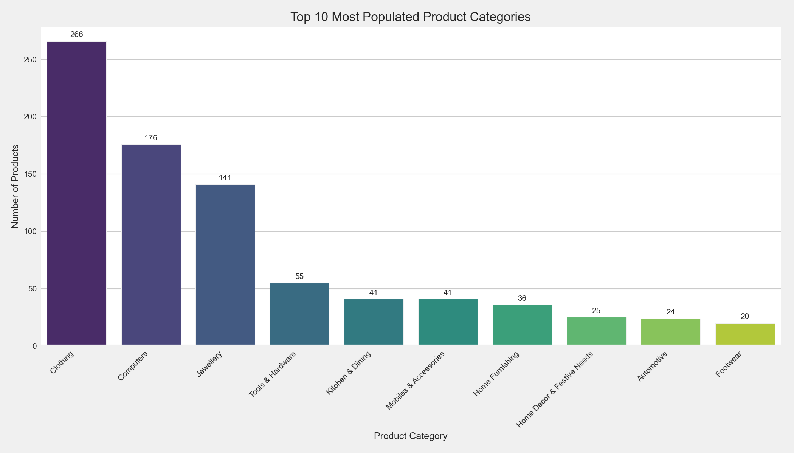
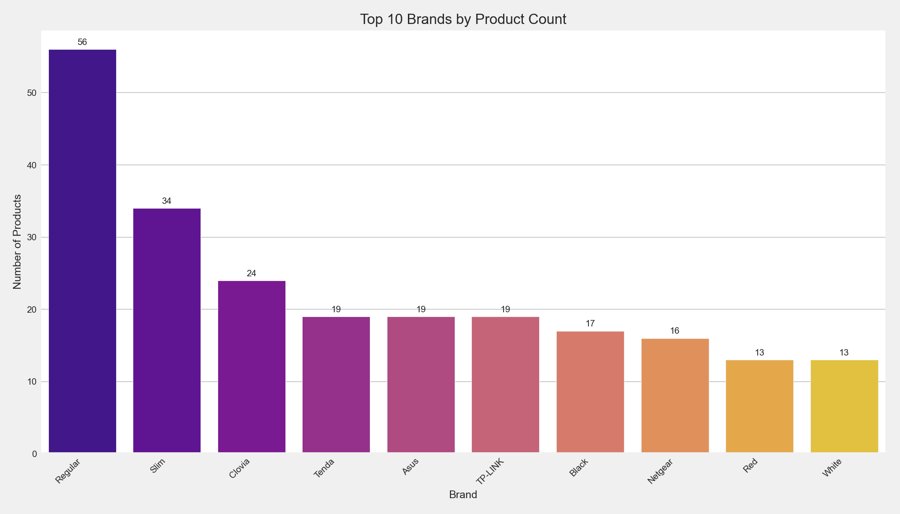
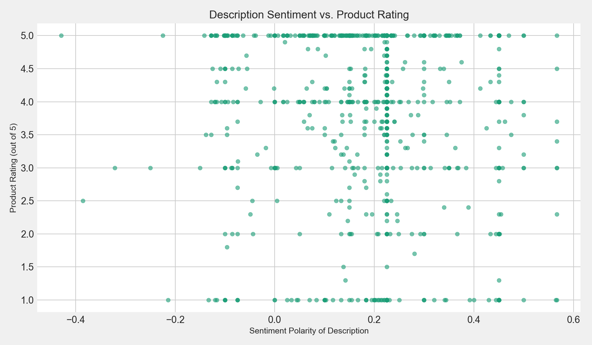
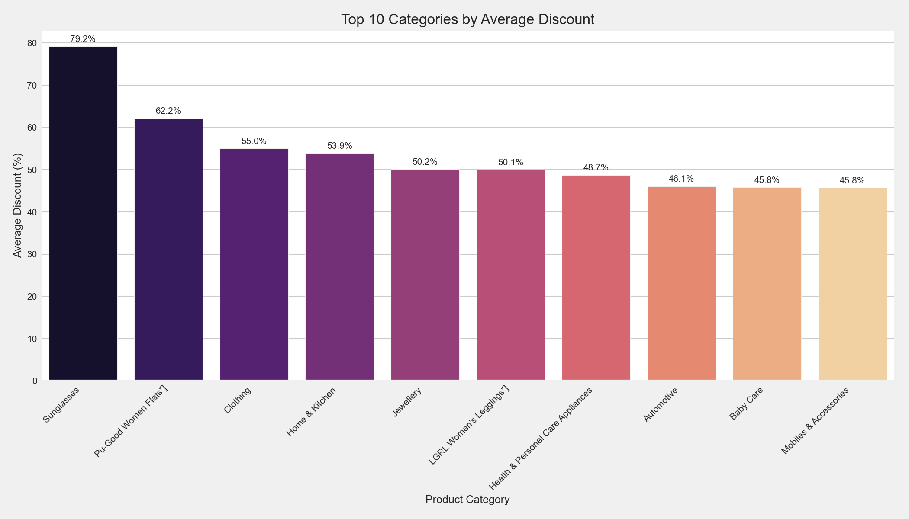

# Flipkart Sales Data Analysis

This project performs an in-depth analysis of a Flipkart sales dataset to uncover insights into customer behavior, product trends, and pricing strategies. The analysis uses Python with libraries like Pandas, Matplotlib, Seaborn, and TextBlob to clean the data, generate visualizations, and perform sentiment analysis.

## Project Structure

- `analysis.py`: The main Python script that contains all the code for data cleaning, analysis, and visualization.
- `plots/`: This directory contains all the charts and graphs generated by the analysis script.
- `.gitignore`: Specifies which files to exclude from the Git repository, such as the raw dataset and cleaned CSV file.

## How to Run the Project

1.  **Clone the repository:**
    ```bash
    git clone https://github.com/UnnatiModanwal/Flipkart_sales_data-_analysis.git
    cd Flipkart_sales_data-_analysis
    ```

2.  **Install the required libraries:**
    ```bash
    pip install pandas matplotlib seaborn textblob
    ```

3.  **Download the data:**
    You will need to have the `flipkart_com-ecommerce_sample.csv` file in the root of the project directory. *(Note: The dataset is not included in this repository to keep it lightweight.)*

4.  **Run the analysis script:**
    ```bash
    python analysis.py
    ```

The script will process the data, save a `cleaned_data.csv` file, and generate all the plots in the `plots/` directory.

## Key Insights and Visualizations

This analysis uncovers several key insights into Flipkart's sales data. Below are some of the visualizations created:

### Top Product Categories
This chart shows the most popular product categories on Flipkart, dominated by Clothing, Jewelry, and Automotive.



### Top Brands
This plot highlights the most prominent brands on the platform.



### Description Sentiment vs. Product Rating
This unique analysis explores the relationship between the sentiment of the product description and the customer's rating. There appears to be a slight positive correlation, suggesting that more positively-worded descriptions may lead to higher ratings.



### Average Discount by Category
This chart reveals which product categories offer the highest average discounts, providing insights into pricing strategies.



